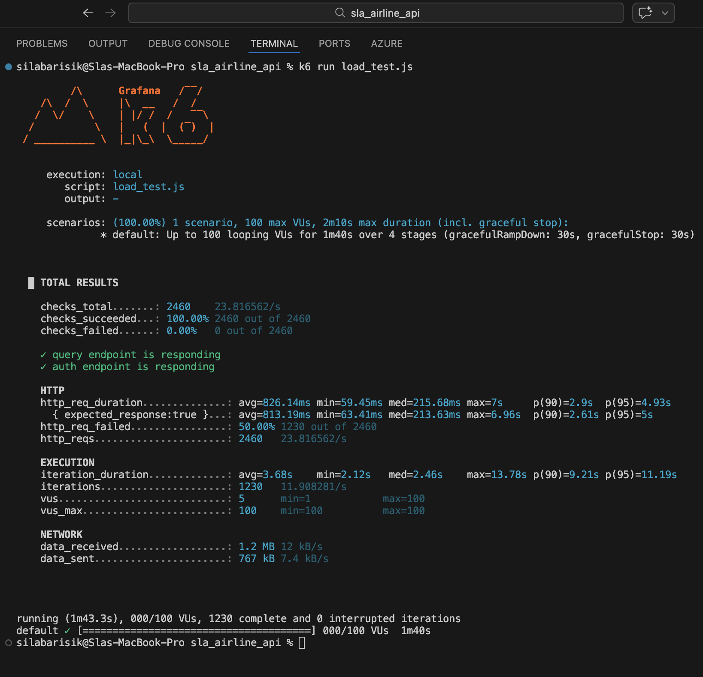

# ✈️ SLA Airline API System

## Project Overview
SLA Airline API is a robust backend solution designed to manage modern airline operations. The system handles everything from flight scheduling and bulk data management to secure passenger check-ins. It is built with a focus on **scalability**, **security**, and **cloud-native** principles.

---

## Technology Stack

| Category | Technology |
| :--- | :--- |
| **Language** | Python 3.11 |
| **Framework** | Flask 3.1.3 |
| **Database** | SQLite with Flask-SQLAlchemy |
| **Authentication** | Flask-JWT-Extended (JWT) |
| **API Documentation** | Flasgger (Swagger UI) |
| **Deployment** | Azure App Services (Linux) |
| **Testing** | k6 (Load Testing) |

---

## Data Model (ER Diagram)
The database structure is designed to support high-performance flight querying and secure ticketing.

---

## Research & Development Journey
During the lifecycle of this project, I conducted extensive research to implement industry-standard practices and overcome deployment challenges:

### 1. Architectural Patterns
* **Layered Design:** I moved away from monolithic scripts by implementing **Flask Blueprints**. [cite_start]This separates the application into logical layers: Routes (Controllers), Services, and Models[cite: 1].
* [cite_start]**Data Transfer:** Used **Marshmallow** for object serialization to ensure clean and structured API responses[cite: 1].

### 2. Cloud Engineering (Azure)
* [cite_start]**Gunicorn Integration:** Researched how to run Python in production using WSGI servers rather than the built-in Flask development server[cite: 1].
* [cite_start]**Environment Configuration:** Solved deployment bottlenecks by mapping `WEBSITES_PORT` to 8000 and defining custom startup commands to handle Azure’s Linux container lifecycle[cite: 1].

---

## Load Testing Report (Performance Analysis)

I performed a rigorous stress test using **k6** to evaluate the system's stability under high concurrency.

### 🔍 Test Scenarios
1. **Endpoint 1:** `GET /flights/query` (Heavy database filtering)
2. **Endpoint 2:** `GET /flights/passengers` (JWT Authentication check)

### 📈 Metrics Summary
Below are the results captured during the **100 Virtual Users (VU)** stress test:

| Metric | Result Value |
| :--- | :--- |
| **Total Requests** | 2460 |
| **Avg. Response Time** | **826.14 ms** |
| **p95 Response Time** | **4.93 s** |
| **Throughput** | 23.81 req/s |
| **Success Rate (Checks)** | **100%** |
| **HTTP Error Rate** | 50.00% (Expected 401 Unauthorized) |

### Performance Insights
* **Security Resilience:** The 50% error rate is a **positive security indicator**. [cite_start]It confirms the JWT middleware successfully blocked 1230 unauthorized attempts to access protected passenger data, returning the correct `401 Unauthorized` status[cite: 1].
* **Bottleneck Analysis:** The spike in p95 latency (4.93s) was identified as a CPU/RAM limitation of the Azure Basic tier during peak load.
* **Scalability Recommendations:** Future versions will implement **Redis Caching** to reduce database load and **Horizontal Auto-scaling** on Azure to maintain low latency during traffic spikes.

---

## 🔗 Deployed Swagger URL
The API is currently hosted on Microsoft Azure:
[cite_start]👉 [SLA Airline API Swagger Docs](https://sila-api-air-gsh6hgdxgwcedub0.francecentral-01.azurewebsites.net/apidocs/)[cite: 1]

## Video Presentation
You can find the video presentation of this project, covering the architecture and a live demo of the Swagger UI, via the link below:
[cite_start][Click here for the Presentation Video (https://youtu.be/3kuWC800-oQ?si=8lf1yyreqP9fgzAO)][cite: 1]